# 🏛️ Civic Issue Reporting Platform V2
### *Empowering Citizens to Build Better Communities*

<div align="center">


[🌟 Features](#-key-features) • [🚀 Quick Start](#-quick-start) • [📸 Screenshots](#-screenshots) • [🛠️ Tech Stack](#-tech-stack) • [🤝 Contributing](#-contributing)

</div>

---

## 📖 About The Project

The **Civic Issue Reporting Platform** is a modern web application designed to bridge the gap between citizens and local authorities. This platform enables community members to report civic issues, track their resolution status, and actively participate in improving their neighborhoods.

### 🎯 Problem Statement
Citizens often struggle to report civic issues like potholes, broken streetlights, or garbage collection problems to the appropriate authorities. Traditional reporting methods are inefficient, lack transparency, and provide no feedback mechanism.

### 💡 Our Solution
A user-friendly digital platform that streamlines the entire issue reporting process with real-time tracking, automated routing to relevant departments, and transparent status updates.

---

## 🌟 Key Features

<table>
<tr>
<td width="50%">

### 📱 For Citizens
- **Easy Issue Reporting** - Report issues with photos and location
- **Real-time Tracking** - Monitor issue resolution progress
- **Community Engagement** - Upvote and comment on reported issues
- **Push Notifications** - Get updates on your reports
- **Issue Categories** - Organized reporting system

</td>
<td width="50%">

### 🏢 For Authorities
- **Dashboard Analytics** - Comprehensive overview of issues
- **Priority Management** - AI-powered issue prioritization
- **Department Routing** - Automatic assignment to relevant teams
- **Performance Metrics** - Track resolution times and efficiency
- **Resource Allocation** - Data-driven decision making

</td>
</tr>
</table>

---

## 🔄 How It Works

```mermaid
flowchart TD
    A[👤 Citizen] -->|Reports Issue| B[📝 Issue Form]
    B --> C{📷 Add Photo/Location?}
    C -->|Yes| D[📸 Upload Media]
    C -->|No| E[✍️ Text Description]
    D --> F[🔄 Submit Issue]
    E --> F
    F --> G[🤖 AI Categorization]
    G --> H[📊 Admin Dashboard]
    H --> I[👥 Department Assignment]
    I --> J[🔧 Issue Resolution]
    J --> K[✅ Status Update]
    K --> L[📱 Citizen Notification]
    L --> M{😊 Satisfied?}
    M -->|Yes| N[⭐ Rate & Close]
    M -->|No| O[💬 Add Feedback]
    O --> I
    
    style A fill:#e1f5fe
    style N fill:#c8e6c9
    style G fill:#fff3e0
    style H fill:#fce4ec
```



---

## 🚀 Quick Start

### Prerequisites
Ensure you have the following installed:
- **Node.js** (v18.0.0 or higher)
- **npm** (v9.0.0 or higher)
- **Git**

### 📥 Installation

1. **Clone the repository**
   ```bash
   git clone https://github.com/MrPanda009/SIH-Project-V2.git
   cd SIH-Project-V2
   ```

2. **Install dependencies**
   ```bash
   npm install
   ```

3. **Start the development server**
   ```bash
   npm run dev
   ```

4. **Open your browser**
   ```
   Navigate to http://localhost:3000
   ```

---

## 📂 Project Structure

```
SIH-Project-V2/
│
├── 📁 src/
│   ├── 📁 components/     # Reusable UI components
│   ├── 📁 pages/          # Application pages
│   ├── 📁 services/       # API services
│   ├── 📁 utils/          # Utility functions
│   └── 📁 assets/         # Images, icons, etc.
│
├── 📁 public/             # Static files
├── 📄 package.json        # Dependencies & scripts
├── 📄 README.md           # Documentation
└── 📄 .env.example        # Environment variables template
```

---

## 🛠️ Tech Stack

<div align="center">

| Category | Technologies |
|----------|-------------|
| **Frontend** | React.js, Redux, Material-UI, Tailwind CSS |
| **Backend** | Node.js, Express.js, MongoDB |
| **Authentication** | JWT, OAuth 2.0 |
| **Maps** | Google Maps API / Mapbox |
| **Cloud** | AWS S3 (Media Storage) |
| **Real-time** | Socket.io |
| **Analytics** | Chart.js, D3.js |

</div>

---

## 📸 Screenshots

<details>
<summary>Click to view screenshots</summary>

### 🏠 Homepage
> Clean and intuitive landing page with quick access to report issues

### 📝 Issue Reporting
> Simple form with location picker and image upload

### 📊 Admin Dashboard
> Comprehensive analytics and issue management interface

### 📱 Mobile Responsive
> Fully responsive design for all devices

</details>

---

## 🎨 Design System

Our platform follows a modern, accessible design system:

- **🎨 Figma Design**: [View Design System](https://www.figma.com/design/Y2gFzZTbTSK5hCMUxGnAnN/Civic-Issue-Reporting-Platform)
- **🌈 Color Palette**: Primary Blue (#2196F3), Success Green (#4CAF50), Warning Orange (#FF9800)
- **📝 Typography**: Inter for headings, Roboto for body text
- **♿ Accessibility**: WCAG 2.1 AA compliant

---

## 🗺️ Roadmap

### Phase 1: Core Features ✅
- [x] User authentication
- [x] Issue reporting system
- [x] Basic dashboard

### Phase 2: Enhanced Features 🚧
- [ ] AI-powered issue categorization
- [ ] Multi-language support
- [ ] Mobile application
- [ ] Advanced analytics

### Phase 3: Advanced Integration 📅
- [ ] IoT sensor integration
- [ ] Predictive maintenance
- [ ] Blockchain for transparency
- [ ] Government API integration

---

## 🤝 Contributing

We welcome contributions from the community! Here's how you can help:

1. **Fork the Repository**
2. **Create a Feature Branch**
   ```bash
   git checkout -b feature/AmazingFeature
   ```
3. **Commit Changes**
   ```bash
   git commit -m 'Add some AmazingFeature'
   ```
4. **Push to Branch**
   ```bash
   git push origin feature/AmazingFeature
   ```
5. **Open a Pull Request**

### 📋 Contribution Guidelines
- Write clean, maintainable code
- Follow existing code style
- Add unit tests for new features
- Update documentation as needed

---

## 👥 Team

<div align="center">

| Role | Responsibilities |
|------|-----------------|
| **Frontend Developer** | UI/UX implementation, React components |
| **Backend Developer** | API development, Database design |
| **UI/UX Designer** | Design system, User research |
| **DevOps Engineer** | Deployment, CI/CD pipeline |
| **Project Manager** | Coordination, Timeline management |

</div>

---

## 📜 License

This project is licensed under the MIT License - see the [LICENSE](LICENSE) file for details.

---

## 🙏 Acknowledgments

- **Smart India Hackathon** for the platform and opportunity
- **Open Source Community** for amazing tools and libraries
- **Contributors** who help improve this platform
- **Citizens** who use and provide feedback

---

## 📞 Contact & Support

<div align="center">

### Need Help? Have Questions?

📧 **Email**: support@civicplatform.com  
💬 **Discord**: [Join our community](https://discord.gg/civicplatform)  
🐛 **Issues**: [Report a bug](https://github.com/MrPanda009/SIH-Project-V2/issues)  
📖 **Docs**: [Documentation Wiki](https://github.com/MrPanda009/SIH-Project-V2/wiki)

### ⭐ Star us on GitHub!
If you find this project helpful, please consider giving it a star!

[](https://star-history.com/#MrPanda009/SIH-Project-V2&Date)

</div>

---

<div align="center">

### 🏆 Built for Smart India Hackathon 2024

**Making Indian Cities Smarter, One Issue at a Time** 🇮🇳

</div>